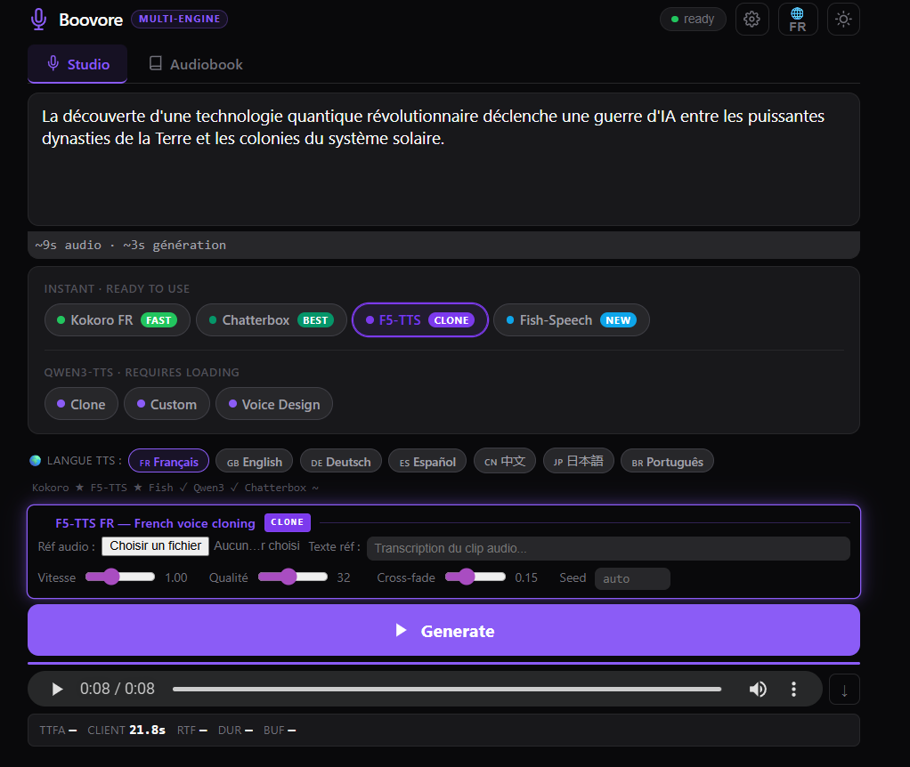

# 🎙 Boovore — Multi-Engine TTS Studio

**Boovore** is a self-hosted, GPU-accelerated Text-to-Speech studio with 5 best-in-class engines and a built-in audiobook generator. Run it on any CUDA machine (tested on RTX 3090) via a clean, dark-mode web UI.

> **Name**: Boovore = *Book* + *Devour* — built to devour books in audio.



---

## ✨ Engines

| Engine | Quality | Speed | Highlights |
|---|---|---|---|
| **Kokoro FR** | ★★★★ | ⚡⚡⚡ | Native French voices |
| **Chatterbox** | ★★★★★ | ⚡⚡ | Zero-shot voice cloning (ResembleAI) |
| **F5-TTS** | ★★★★ | ⚡⚡ | French voice cloning |
| **Fish-Speech 1.5** | ★★★★★ | ⚡⚡ | Multilingual voice cloning (fishaudio) |
| **Qwen3-TTS** | ★★★★★ | ⚡ | Clone · Custom · Voice Design |

---

## 🚀 Quick Start (Vast.ai / GPU server)

### 1. Install dependencies

```bash
# PyTorch nightly CUDA 12.8 (required)
pip3 install --pre torch torchaudio --index-url https://download.pytorch.org/whl/nightly/cu128

# Register torch libs so torchaudio can find libtorch
echo "/usr/local/lib/python3.12/dist-packages/torch/lib" > /etc/ld.so.conf.d/torch.conf && ldconfig

# Core engines
pip3 install faster-qwen3-tts kokoro f5-tts fastapi uvicorn[standard] python-multipart

# Chatterbox (Python 3.12 fix)
pip3 install conformer==0.3.2 --no-build-isolation
git clone https://github.com/resemble-ai/chatterbox /tmp/chatterbox
cd /tmp/chatterbox && pip3 install -e . --no-deps && cd /root

# Fish-Speech 1.5
git clone https://github.com/fishaudio/fish-speech /tmp/fish-speech
cd /tmp/fish-speech && git checkout v1.5.1
pip3 install -e . --no-deps
huggingface-cli download fishaudio/fish-speech-1.5 --local-dir /root/fish-speech-model
```

### 2. Start the server

```bash
nohup python3 server.py --port 7860 >> /root/server.log 2>&1 &
```

### 3. Open the UI

```bash
# Local SSH tunnel
ssh -p <PORT> root@<HOST> -L 7860:localhost:7860 -N
# Then open http://localhost:7860
```

---

## 📖 Features

- **TTS Studio** — one-click engine selector (7 pills), single generate button
- **Audiobook Generator** — import `.txt` / `.pdf` / `.epub`, auto-detect chapters, batch generate with any engine, download per chapter or merge into one WAV
- **Voice Cloning** — upload a reference audio clip (Chatterbox, F5-TTS, Fish-Speech, Qwen3)
- **Real-time metrics** — TTFA, RTF, duration, buffer
- **Light / dark theme**
- **Streaming audio** (Qwen3) with CUDA Graphs

---

## 🗂 Project Structure

```
server.py       — FastAPI backend (5 engines)
index.html      — UI single-page (vanilla JS, aucune dépendance frontend)
requirements.txt
Dockerfile
```

---

## ⚙️ Requirements

- Python 3.12+
- CUDA 12.8 (RTX 3090 or better recommended)
- PyTorch nightly cu128 (`2.12.0.dev+`)
- VRAM: 8 GB minimum, 24 GB to run all engines simultaneously

---

## 📦 Models (auto-downloaded)

| Modèle | Taille | Engine |
|---|---|---|
| `Qwen/Qwen3-TTS-12Hz-0.6B-Base` | ~1.2 GB | Qwen3-TTS |
| `hexgrad/Kokoro-82M` | ~300 MB | Kokoro FR |
| `SWivid/F5-TTS` | ~1.2 GB | F5-TTS |
| `resemble-ai/chatterbox` | ~1.5 GB | Chatterbox |
| `fishaudio/fish-speech-1.5` | ~1.4 GB | Fish-Speech |

---

## 🏷️ GitHub Topics

`text-to-speech` `tts` `voice-cloning` `audiobook` `french-tts` `kokoro` `f5-tts` `fish-speech` `chatterbox` `qwen3` `fastapi` `cuda` `self-hosted` `gpu` `french` `multilingual`

---

## Credits

- [faster-qwen3-tts](https://github.com/huggingfaceM4/faster-qwen3-tts) — Qwen3-TTS engine
- [Fish-Speech](https://github.com/fishaudio/fish-speech) — fishaudio
- [Chatterbox](https://github.com/resemble-ai/chatterbox) — ResembleAI
- [F5-TTS](https://github.com/SWivid/F5-TTS) — SWivid
- [Kokoro](https://github.com/hexgrad/kokoro) — hexgrad

---

MIT License
